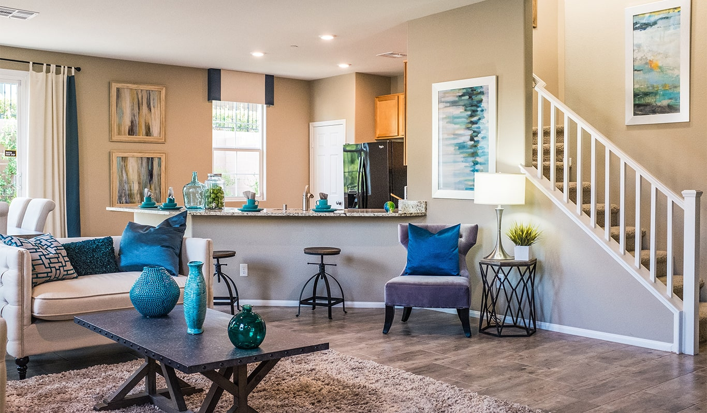
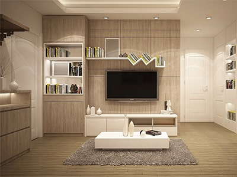

#  AicuSa Interiors — Interior Design Website

A responsive, multi-page interior design company website built with HTML, CSS, Bootstrap 4, and JavaScript.



---


##  Table of Contents

- [About the Project](#about-the-project)
- [Features](#features)
- [Pages](#pages)
- [Tech Stack](#tech-stack)
- [Folder Structure](#folder-structure)
- [Getting Started](#getting-started)
- [Screenshots](#screenshots)
- [Credits](#credits)
- [License](#license)

---

##  About the Project

**AicuSa Interiors** is a fully responsive front-end website for an interior design firm. It showcases the company's services, completed projects, team members, client testimonials, and blog articles — providing a professional and elegant online presence.

> *"We are defined by a commitment to excellence and a passion to bring dreams to reality."*

---

##  Features

-  Fully responsive design (mobile, tablet, desktop)
-  Auto-sliding hero carousel
-  Filterable project portfolio (All / Complete / Running / Upcoming)
-  Services carousel using Owl Carousel
-  Testimonials slider
-  Team section with social media links
-  Blog section with article previews
-  Newsletter subscription form
-  Lightbox image viewer for portfolio
-  Smooth scroll & back-to-top button
-  Font Awesome & Flaticon icon integration

---

##  Pages

| Page | Description |
|------|-------------|
| `index.html` | Home page with carousel, about, services, projects, team, testimonials & blog |
| `about.html` | Detailed about page |
| `service.html` | Full services listing |
| `project.html` | Portfolio/projects page |
| `blog.html` | Blog grid layout |
| `single.html` | Single blog post detail |
| `contact.html` | Contact form & map |

---

##  Tech Stack

| Technology | Usage |
|------------|-------|
| HTML5 | Page structure & markup |
| CSS3 | Custom styling |
| Bootstrap 4 | Responsive grid & UI components |
| JavaScript / jQuery | Interactivity & DOM manipulation |
| Owl Carousel | Service & team sliders |
| Isotope.js | Portfolio filtering |
| Lightbox2 | Portfolio image viewer |
| Font Awesome 5 | Icons |
| Flaticon | Custom interior design icons |
| Google Fonts | Montserrat & Oswald typography |

---

##  Folder Structure
```
Interior_Design_website/
│
├── index.html
├── about.html
├── service.html
├── project.html
├── blog.html
├── single.html
├── contact.html
│
├── css/
│   └── style.css
│
├── js/
│   └── main.js
│
├── img/
│   ├── carousel-1.jpg
│   ├── carousel-2.jpg
│   ├── portfolio-1.jpg ... portfolio-6.jpg
│   ├── team-1.jpg ... team-4.jpg
│   ├── blog-1.jpg ... blog-3.jpg
│   └── ...
│
├── lib/
│   ├── owlcarousel/
│   ├── lightbox/
│   ├── isotope/
│   ├── easing/
│   └── flaticon/
│
└── mail/
    ├── contact.js
    └── jqBootstrapValidation.min.js
```

---

##  Getting Started

### Prerequisites

No build tools required. Just a browser and a code editor.

### Installation

1. **Clone the repository**
```bash
   git clone https://github.com/satviklandge/Interior_Design_website.git
```

2. **Navigate into the project folder**
```bash
   cd Interior_Design_website
```

3. **Open in your browser**
```bash
   # Simply open index.html in any browser
   open index.html
```
   Or use the **Live Server** extension in VS Code for the best experience.

---

##  Screenshots

| Section | Preview |
|--------|---------|
| Hero Carousel |  |
| Portfolio |  |

---

##  Credits

- Design & Development — **Valentine Fernandes**
- Icons — [Font Awesome](https://fontawesome.com) & [Flaticon](https://flaticon.com)
- Fonts — [Google Fonts](https://fonts.google.com)
- Carousel — [Owl Carousel](https://owlcarousel2.github.io/OwlCarousel2/)
- Lightbox — [Lightbox2](https://lokeshdhakar.com/projects/lightbox2/)
- Grid Filter — [Isotope](https://isotope.metafizzy.co/)
- UI Framework — [Bootstrap 4](https://getbootstrap.com)

---

##  License

This project is open source and available under the [MIT License](LICENSE).

---

<p align="center">Made  by <a href="https://github.com/satviklandge">Satvik Landge</a></p>
